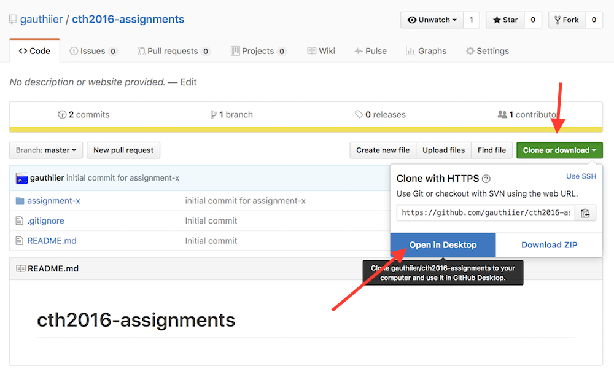
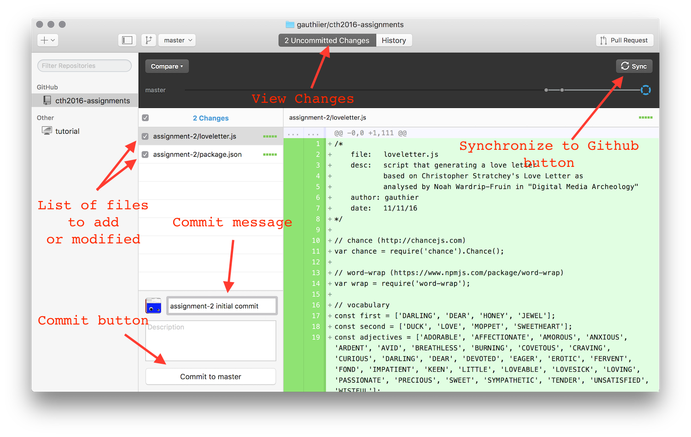

## Initialising your assignments repository 

What follows is a recipe to initialise a git repository for your class assignments. 

### Step 1: Create repository on Github

First create a repository under your github account. To do so, login to [Github](https://github.com) and on the top/right corner of the page select the '+' symbol and 'New repository'


Then fill in the information for the assignments repo.

__* Note 1: Select "Initialize this repository with a README"__
__* Note 2: From the "Add .gitignore" drop down menu, selecte Node__


### Step 2.0: Clone the repository to your own machine using git

Now that you have a github repo, you need to ```clone``` it to your machine. Open a terminal and navigate (```cd``` and ```ls```) to a prefered directory on your machine where you want your assignments to reside (for instance the Desktop).

When this is done, select the "Clone or download" menu on your githib repo's page and copy the listed url: 

 

Coming back to your terminal, simply type the following to ```clone``` the repo on your machine: 

	$ git clone your-github-repo-url

(where your-github-repo-url is your copied/pasted url from github)

This will create a directory under the current folder where your terminal is. To view the changes, simply type: 

	$ ls -al

### (Alternative) Step 2.1: Clone the repository to your own machine using Github Desktop

This is an alternative to Step 2.0: Clone the repository to your own machine using git

You can download a special Github GUI interface for git here: [https://desktop.github.com](https://desktop.github.com)

Now to clone your repository (created on Step 1), select "Clone or download" menu on your githib repo's page and click on the "Open in Desktop":



This will open Gihub Desktop and ask where you what to clone your Gihub repository on your machine.

For more information, please visit: [https://help.github.com/desktop/guides/contributing/cloning-a-repository-from-github-to-github-desktop/](https://help.github.com/desktop/guides/contributing/cloning-a-repository-from-github-to-github-desktop/)

-------

## Creating a new assignment (Node + Git)

What follows is a recipe to create a new assignment in your newly initialised git assignments repository.

### Step 1: Create a new directory under your assignments repository

If you have followed the previous section, you should now have a repositroy on your machine which is linked to your github account. Let's assume that your repo is named ```cth2016-assignments/``` and resides on your Desktop. 

To create a new assigment, you need to point your terminal to the repo:

	$ cd ~/Desktop/cth2016-assignments/

and then create a new directory, which I will call ```assignment-x```. To do so, on the terminal, simply type:

	$ mkdir assignment-x
	$ cd assignment-x	

This will create a new direcory ```assignment-x``` under ```~/Desktop/cth2016-assignments/```. The ```cd``` command puts your terminal inside this newly created directory so that you can initialise your actual project in step 2.

### Step 2: Initialise you project with npm init

Node has a package manager named ```npm``` (n-ode, p-ackage, m-anager) that automates the task of creating a project from scratch and configures it in a way that is compatible with other node projects. We will use ```npm``` during the module. 

To initialise your new assignment under ```assignment-x```, simply emit the follow command:

	$ npm init

With this commad you will be asked various questions regarding your project's name, version, description, entry point, author, etc. which you can configure at will (press <'enter'> to select and move to the next configuration step). 

A ```package.json``` file is created upon the completion of ```npm init```. This file contains all the configurations you selected and can be edited manually.

### Step 3 (optional): npm install --save commander 

This step is optional, yet recommended for your assignment. When making a node application, modules/libraries can be made part of your project using ```npm```. Thousands of javascript libraries are available on [www.npmjs.com](https://www.npmjs.com) which you can install with a simple ```npm``` command. 

As in the first session of the class on the Command Line Interface (CLI), we will be using ["commander"](https://www.npmjs.com/package/commander) for our applications. To install it for you assignment, use the following command:

	$ npm install --save commander

This will create a ```node_modules``` directory next to ```package.json``` where the commander code is placed. All modules installed using ```npm``` will reside in this ```node_modules``` directory.

### Step 4: Create your actual assigment script(s)

Now that you have an npm project created and installed commander it is time to create your script(s). For instance, in this example, I will create ```index.js``` file containing the code for the fake assignment. This file can be called anything (for instance, person.js as in the example in class during week1).

Though since I am not following a proper assignment per se, I will simply create a simple tri-lingual script that will output ```"Hello!"```, ```"Dag!"``` or ```"Allô!"``` depending on a command line arguments passed to the script which can be of the type ```en``` (english), ```nl``` (nederlands), ```fr``` (français) or nothing.

To create ```index.js``` simply type (or, alternatively, create it with Sublime Text):

	$ touch index.js

Now open the file usign Sublime Text, copy/paste or input the desired code and save:

```javascript

// simplest tri-lingual program 

var program = require('commander');
 
program
  .version('0.1')
  .option('-l, --language [code]', 'Language', /^(en|nl|fr)$/i)
  .parse(process.argv);

switch(program.language)
{
	case('en'):
		console.log('Hello!');
		break;
	case('nl'):
		console.log('Dag!');
		break;
	case('fr'):
		console.log('Allô!');
		break;
	default:
		console.log('...');
		break;
}
```

### Step 5: Run you script

To run the script 

	$ node index.js -l fr
	Allô!

where you can replace ```fr``` by ```en``` or ```nl``` or nothing. Try it out!

If you called you script another name (for instance, person.js), please change the above ```index.js``` with the name of your own script.

### Step 6: Create a README

One of the interesting feature of commander is that it can auto generate a ```"help"``` output from your script based on the command line options you have listed in your program. 

To see this help output, simply type: 

	$ node index.js --help

```
  Usage: index [options]

  Options:

    -h, --help             output usage information
    -V, --version          output the version number
    -l, --language [code]  Language

```

It is very common for command line scripts to feature such ```--help``` argument that when executed, displays what the program expects as input. Thus, for this class, each README you will create (for both assignments and final project) is expected to have (at least) this type of "helper documentation". 

To initialise a README and add the ```help``` output from your script:

	$ node index.js --help > README

Alternatively, you can create the README with Sublime Text and copy/paste the result of the ```--help``` manually. 

It is a very good practice to start the redaction with the ```--help``` as it signals how to use your script to people that may be interested in it.

### Step 7: Add your created files to git

Now that you have a proper project initialised, the next step is to add all its files to git. 

To view which file needs to be added to git type:

	$ git status

This should indicate which directories and/or files are untracked by git. 

If you have followed the previous steps, ```git status``` should simply signal that the current directory ```./``` is untracked. To add it to git:

	$ git add ./

To make sure git properly added the new assignment, simply type (again):

	$ git status

and check that your ```package.json```, ```index.js``` (or whatever you have called your file(s)), and ```README``` are marked as new files (green).

### Step 8: Commit your changes and push to Github

The next step is to commit these new files to your local git repo:

	$ git commit -a -m "initial commit for assignment-x"

And push the commit to your assignments github repo:

	$ git push origin master

You should now see these changes online in your new ```cth2016-assignments/assignment-x/``` directory:

 

NOTE: ```node_modules``` is not be pushed to github, why? Because when someone will clone your project (your instructor for example), she/he will ```npm install``` it her/himself as it is listed as a dependency in ```package.json```.

### (Alternative) Steps 7-8: Add, Commit and Synchronise your work with Github Desktop

This is an alternative to Steps 7 and 8.

When you have cloned your repository using Github Desktop, you can synchronize the changes you have made in Steps 1 to 6 using the Github desktop interface: 



First, commit your changes with the "Commit button" then synchronize your changes using the "Sync" button.

-------

## Updating your assignment as you make progress

It is assumed that you will make many changes to your assigment while your a working on it.

The ususall cycle of working on some piece of code is to first (1) add you files to the repo (re: Step 7), (2) modify your files while you are working, and (3) when your code is working as inteted, commit your changes and push to github (re: Step 8).

The usual updating loop looks a bit like this:

1. ```git status```
2. (optional) ```git add``` xyz depending on what was added to the project while working on it.
3. ```git commit -a -m "message for the commit"```
4. ```git push origin master```
5. work a bit more
6. loop and goto 1.

----------

## (Alternative) Updating your assignment as you make progress using Github Desktop

When you have cloned your repository using Github Desktop, you can synchronize the changes you are making using the Github desktop interface: 


First, commit your changes with the "Commit button" then synchronize your changes using the "Sync" button.

For more information: [https://help.github.com/desktop/guides/contributing/committing-and-reviewing-changes-to-your-project/](https://help.github.com/desktop/guides/contributing/committing-and-reviewing-changes-to-your-project/)


## External Resources

Github

* [Github Help - Set Up Git](https://help.github.com/articles/set-up-git/)
* [Github Help - Adding an existing project](https://help.github.com/articles/adding-an-existing-project-to-github-using-the-command-line/)
* [Github Desktop](https://help.github.com/desktop/guides/)

Git

* [Git - Getting Started](https://git-scm.com/book/en/v1/Getting-Started)
* [Git - Getting Started (Videos)](https://git-scm.com/videos)
* [Software Carpentry - Git Tutorial](http://swcarpentry.github.io/git-novice/)

Node

* [Nodeschool](https://nodeschool.io/#workshopper-list)


